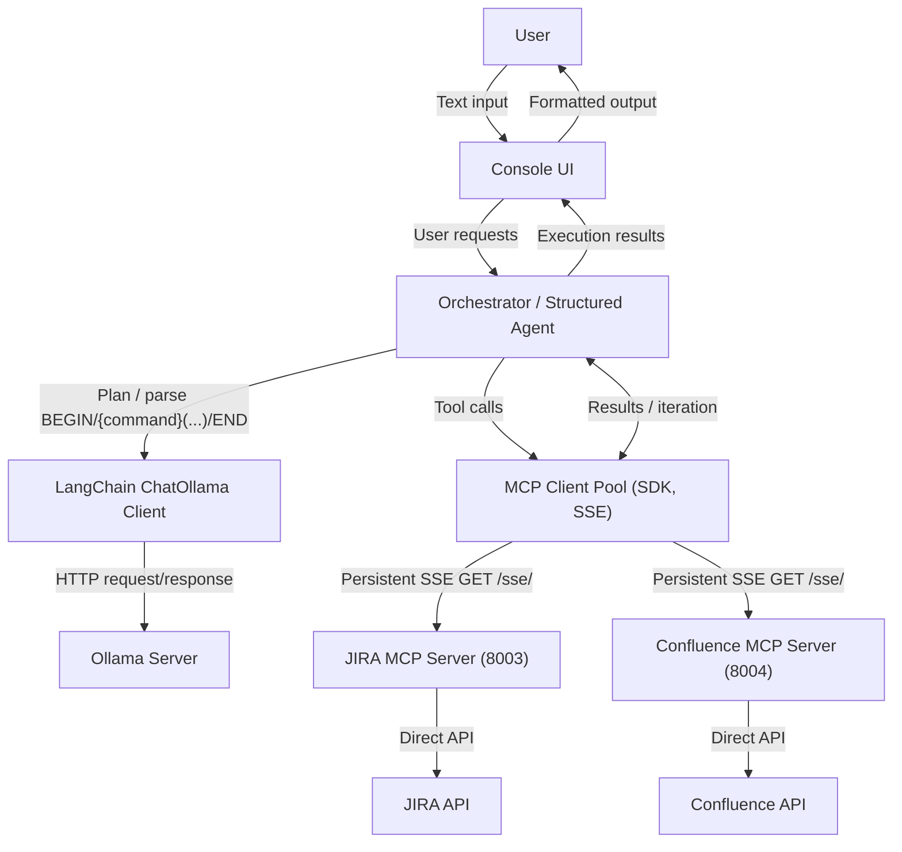

## Data Access Tier — Minimal Agent Architecture (Version 2)

## Overview

This Version 2 design removes the LlamaStack server and keeps a minimal, fast, CPU‑friendly stack:
- LLM via LangChain ChatOllama (package `langchain-ollama`) talking to the local Ollama server for pure text generation.
- Custom MCP client (SDK-based SSE: `ClientSession`, `sse_client`) to call tools on JIRA/Confluence MCP servers.
- Orchestrator that prompts the LLM to plan in a structured format (per `Source/Prompts/planner_prompt_template.txt`), parses structured BEGIN/{command}(...)/END blocks, executes tools via MCP, and iterates as needed. Allowed commands: QUERY, TASK, ERROR.
- Console UI layer providing an interactive interface for user interaction, status display, and table reporting.
- No model-native tool calling required; planning and tool execution are fully controlled by our orchestrator.
- Focus on low-latency CPU operation, robust retries/timeouts, and clean separation of LLM vs tools.

## High-Level Goals

- Performance on CPU-only: sub-3s tool overhead, minimal memory, avoid busy-wait
- Deterministic orchestration: structured prompts, explicit CALL(...) parsing, no model-native tool-calling
- Reliability: persistent SSE, bounded timeouts, limited retries, graceful degradation
- Observability: structured logs, per-call timings, correlation IDs
- Extensibility: plug-and-play MCP endpoints, auto tool discovery, minimal config
- Operational simplicity: no LlamaStack server, single-process client, easy env/CLI config
- Compatibility: works with existing JIRA/Confluence MCP servers and Ollama models
- Testability: unit mocks for LLM/MCP, integration against local servers

## System Context
The orchestrator mediates between an LLM (Ollama via LangChain) and multiple MCP servers via a persistent SSE client pool. The console UI provides an interactive interface for user interaction and result display.



## Core Components

## LLM Layer (Ollama via LangChain ChatOllama)

- The LLM planner lives inside the Orchestrator as a class (e.g., `OrchestratorLLM`). It owns prompt construction and LLM invocation. The orchestrator owns parsing and tool execution.

- Dependency: `langchain-ollama` (preferred). Install: `python -m pip install -U langchain-ollama`
- Import path: `from langchain_ollama import ChatOllama`
- Alternative (older stacks): `from langchain_community.chat_models import ChatOllama`

Minimal usage:

```python
from langchain_ollama import ChatOllama

llm = ChatOllama(
    model="phi3.5:3.8b",          # or other local model tag available in Ollama
    temperature=0.0,
    base_url="http://localhost:11434",  # default Ollama endpoint
)

response = llm.invoke("What is the capital of France?")
print(response.content)
```

Notes:
- Ensure the Ollama server is running and the target model is pulled (e.g., `ollama pull phi3.5:3.8b`).
- Keep timeouts short and add retries at the orchestration layer; ChatOllama should be used for pure text generation only.

### Prompt Protocol & Template

- Template file: `Source/Prompts/planner_prompt_template.txt`
- Placeholders: `{tools_section}`, `{examples_section}`, `{user_input}`
- Output protocol: strictly
  - `BEGIN`\n
  - `{command}(...)` where `{command}` ∈ {`QUERY`, `TASK`, `ERROR`}
  - `END`
- Tools are injected dynamically from MCP registration via `set_tools(name, description)` and rendered into `{tools_section}`.
- The orchestrator may optionally expose a getter to inspect the last built prompt for debugging.

## MCP Layer (SDK-Based SSE Client)

The MCP layer is a synchronous facade with async internals. It exposes a small API to the orchestrator while hiding network/process complexity.

- Sync facade: `start(config_path)`, `list_llm_tools()`, `execute(tool_name, args)`, `stop()`
- Background thread: hosts an asyncio event loop for the async MCP SDK
- Tool registry: merges built-in tools (e.g., `ping`) with tools discovered from configured MCP servers
- Remote calls: default to ephemeral sessions (connect → call → close) for robustness; optional persistent sessions for low-latency use cases
- Optional server management: can launch MCP servers as child processes per config, or connect to externally managed servers

Internals (key structures)
- Map tool → server for routing remote `execute(...)`
- Map tool → description for planner prompt injection
- Server process handles (if launched locally) with clean shutdown
- Async loop/thread readiness gates and error handling

## Console UI Layer

The console UI provides an interactive interface for user interaction, status display, and table reporting. It integrates with the Orchestrator to provide a user-friendly way to interact with the system.

### **Architecture**
- **Location**: `Source/console/` folder
- **Main Class**: `ConsoleUI` - handles user input/output and command processing
- **Table Reporting**: `TableReporter` - generates clean, bordered tables for dynamic data
- **Status Display**: `StatusIndicator` - shows execution status, timing, and progress with emoji indicators
- **Built-in Commands**: `/help`, `/tools`, `/status`, `/clear` for system navigation

### **View System**
The console UI includes a specialized view system that automatically renders different data types using appropriate visual formats based on the MCP tool that generated the data.

#### **View Architecture**
- **ViewManager**: Routes events to specialized view renderers based on tool names
- **BaseView**: Abstract interface for all specialized views
- **Specialized Views**: Tool-specific renderers (e.g., `JiraIssueView`, `JiraSearchView`)
- **Generic Fallback**: Default view for unknown tool types or when specialized views fail

#### **View Registry & Configuration**
Views are configured via config files for flexibility:
```yaml
views:
  get_jira_issue: JiraIssueView
  search_issues: JiraSearchView
  get_epic: JiraEpicView
  search_confluence: ConfluenceSearchView
```

#### **Specialized View Examples**
- **JIRA Issue View**: Formatted display with issue header, metadata table, and description
- **Search Results View**: Clean table format for multiple items
- **Generic View**: Fallback table display for any structured data

#### **Error Handling**
- Views gracefully handle malformed data
- Error messages displayed at bottom of view content
- Always fallback to generic view if specialized view fails

### **Key Features**
- **Interactive Loop**: Continuous user input with `mcp_jira>` prompt
- **Transparent Event Display**: No parsed events shown to user (clean interface)
- **Simple Table Borders**: Clean, professional table formatting using `rich` library
- **Status Indicators**: Emoji-based status (⏳✅🔍) with execution timing for every operation
- **Generic Table Generation**: Dynamic table creation for any structured data (JIRA tickets, content lists, etc.)
- **Command History**: Basic command history and navigation
- **Error Handling**: User-friendly error messages and status feedback
- **Specialized Views**: Contextually appropriate displays for different data types

### **User Experience Flow**
1. **Input**: User types natural language request or built-in command
2. **Processing**: Console shows status indicators and timing
3. **Execution**: Orchestrator processes request through LLM planning and MCP execution
4. **Results**: Formatted tables and status information displayed
5. **Ready**: Return to prompt for next input

### **Dependencies**
- **`rich`**: For beautiful console output, tables, and status indicators
- **`orchestrator`**: For processing user requests and executing tools
- **`protocol_parser`**: For handling LLM output parsing (transparent to user)

## Orchestrator / Agent Flow

## Execution Lifecycle

1) Construct `McpLayer()`
2) `start(config_path)`
   - Load JSON/YAML config; validate required fields (`name`, `sse_url`)
   - Optionally launch child processes if `command` is present
   - Start background asyncio loop (thread) and verify it is running
   - Discover tools from each configured server; merge into planner tool list
3) Orchestrator builds prompts with `list_llm_tools()` and plans
4) When execution is requested, `execute(tool, args)`
   - If local tool, call directly
   - Else route to the mapped server and call via SDK (ephemeral by default)
5) `stop()`
   - Close persistent sessions (if enabled)
   - Stop loop/thread
   - Terminate child processes (if any)

## Console UI Integration

The console UI integrates with the orchestrator through a clean interface:

1) **User Input**: Console captures user requests and built-in commands
2) **Request Processing**: Console passes natural language requests to orchestrator
3) **Status Display**: Console shows real-time status and timing during execution
4) **Result Formatting**: Console formats orchestrator results into clean tables and status messages
5) **Error Handling**: Console provides user-friendly error messages and recovery options
6) **Specialized Views**: Console automatically selects appropriate view renderers based on tool names

### **View System Integration**
- **Automatic Routing**: Events are automatically routed to specialized views based on `event.tool_name`
- **Fallback Handling**: If no specialized view exists or rendering fails, falls back to generic table view
- **Configuration-Driven**: View mappings configured via config files for easy customization
- **Backward Compatible**: Existing generic table display functionality preserved

### **Built-in Commands**
- **`/help`**: Display available commands and usage
- **`/tools`**: List available MCP tools and their descriptions
- **`/status`**: Show system status, active tools, and connection health
- **`/clear`**: Clear console screen
- **`/quit`**: Exit the application

## Configuration

Config file supports JSON or YAML. Minimal YAML example:

```yaml
servers:
  - name: jira
    sse_url: "http://localhost:8003/sse/"
    # Optional: launch as a child process (for dev/CI)
    command: ["python", "Previous Design/MCP/jira_mcp_server_simple.py"]
    cwd: "/home/stanny/projects/mcp_jira"
    env: {}
    # Optional: keep a persistent session for lower latency
    use_persistent_session: false

  - name: confluence
    sse_url: "http://localhost:8004/sse/"
    command: ["python", "Previous Design/MCP/confluence_mcp_server.py"]
    cwd: "/home/stanny/projects/mcp_jira"
    env: {}
    use_persistent_session: false

# Optional: View system configuration
views:
  get_jira_issue: JiraIssueView
  search_issues: JiraSearchView
  get_epic: JiraEpicView
  search_confluence: ConfluenceSearchView
```

Notes
- JSON is also supported with the same structure.
- If `command` is omitted, the layer will not launch the server and will only attempt to connect.
- Duplicate tool names across servers are allowed but will emit a warning; last one wins.
- View configuration is optional; if omitted, all tools use the generic view.

## Error Handling & Resilience

- Loop readiness: startup verifies the async loop is running; on failure, child processes are cleaned up and startup fails fast
- Discovery errors: logged and non-fatal; local tools remain available
- Remote calls: ephemeral sessions avoid stale connections; exceptions surface to the caller with clear messages
- Persistent sessions (optional): guarded by per-server locks; graceful close on `stop()`
- Child process output: STDOUT/ERR redirected to avoid blocking on full pipes
- Process shutdown: terminate with timeout, then kill; logs on failure

## Performance Considerations

- Default ephemeral calls prioritize robustness; suitable for moderate throughput
- Enable `use_persistent_session` per server for lower call latency and reduced connection overhead
- Keep planner latency low by injecting only relevant tools; measure with `Tests/benchmark_planner_ping.py`

## Observability

- Structured logging in `McpLayer` for start/stop, discovery, routing, and errors
- Add per-call timing at the orchestrator level as needed

## Security Considerations

## Testing Strategy

- Unit tests cover: local tool execution, lifecycle with empty config, startup with unreachable servers, and unknown tool behavior
- Integration tests can point to local MCP servers (dev) using the provided example config

## Roadmap

### **Phase 1: Core View System**
- Implement `BaseView` interface and `ViewManager` class
- Create `JiraIssueView` for the working `get_jira_issue` tool
- Integrate view system with existing console UI

### **Phase 2: Extended Views**
- Add `JiraSearchView` for search results
- Implement `ConfluenceSearchView` for Confluence content
- Add configuration file support for view mappings

### **Phase 3: Enhanced User Experience**
- Improve view formatting and styling
- Add more specialized views for other tool types
- Performance optimization and error handling improvements

